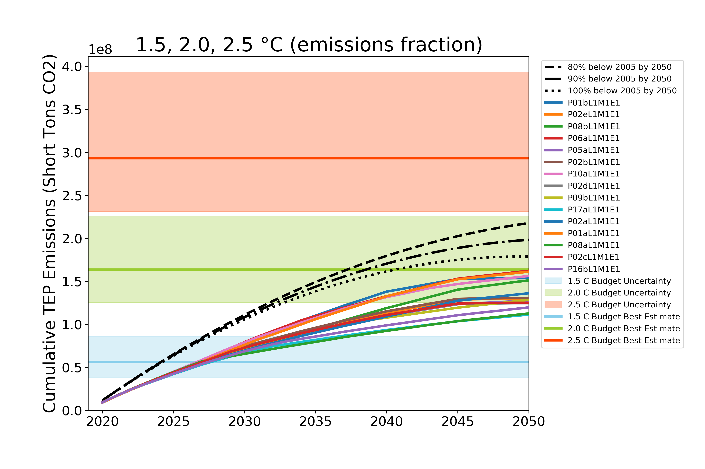

# TEP Carbon Goals

This repository contains the data and analysis University of Arizona
researchers used to guide Tucson Electric Power's carbon goals as part
of their 2020 IRP process.

The jupyter notebook [tep_carbon.ipynb](tep_carbon.ipynb) contains the
analysis. The input data lives in the [data](data) directory and the output
``png`` and ``csv`` files live in the [output](output) directory. The plot
below shows an example.

Click the [launch binder](https://mybinder.org/v2/gh/CLIMAS-UA/tepcarbon/master)
badge at the top of this Readme file to open the notebook in a safe
executable environment on [mybinder.org](https://mybinder.org/). No need
to install or run code on your computer!

If you do want to run the jupyter notebook on your own computer, we
recommend installing the
[Anaconda Python Distribution](https://www.anaconda.com/products/individual).

Click the green "Clone or download" button to download this repository to your
computer (the button is to the upper right of the file listing).
